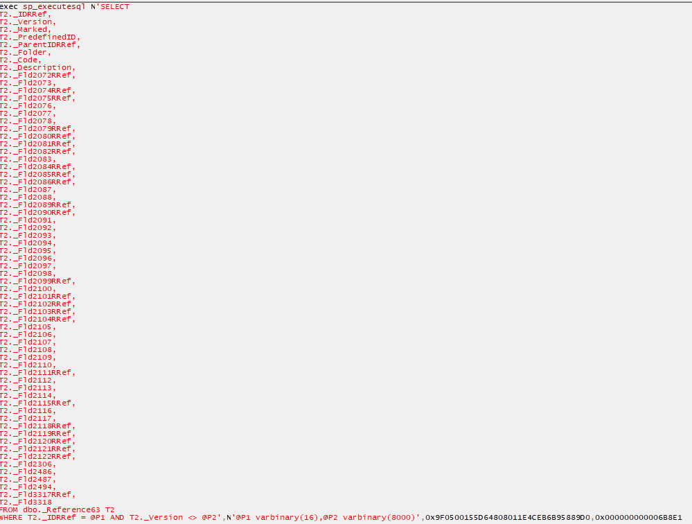
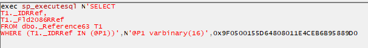

##### В общем случае не нужно получать не используемые данные из базы
##### Пример
Плохо:
```bsl
СтрТабЦГ.ЦГ = стрТовары.Номенклатура.ЦеноваяГруппа;
```
Хорошо:
```bsl
СтрТабЦГ.ЦГ = ОбщийМодульВызовСервера.ЗначенияРеквизитовОбъекта(стрТовары.Номенклатура, "ЦеноваяГруппа", Истина);
```

### Почему плохо

При таком обращении платформа запрашивает из базы все поля **объекта**, включая Табличные части.
На каждую табличную часть строится отдельный запрос, на получение всех полей.
Плохо:

Хорошо:

