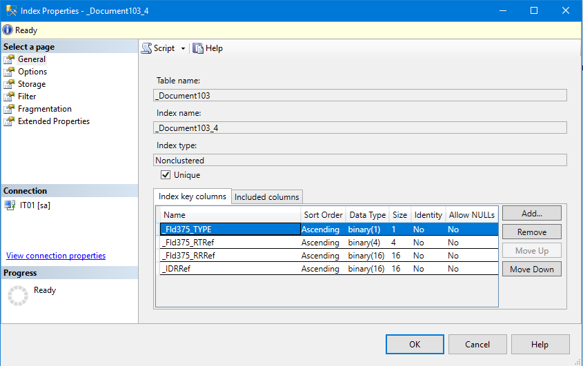

В общем случае, нужно стремиться "попасть в индекс" - использовать в условиях и в соединениях поля которые индексируются.

[Индексы таблиц базы данных](https://its.1c.kz/db/pubapplied#content:333:hdoc)
[Список индексов таблиц базы данных](https://its.1c.ru/db/metod8dev/content/1590/hdoc)


Пример не оптимального запроса :

```bsl
Запрос = Новый Запрос("ВЫБРАТЬ
	|	Задания.Ссылка КАК Ссылка
	|ИЗ
	|	Документ.Задания КАК Задания
	|ГДЕ
	|	Задания.ДокументОснования = &Док
	|	И НЕ Задания.ПометкаУдаления
	|	И ВЫБОР
	|			КОГДА &Ссылка <> НЕОПРЕДЕЛЕНО
	|				ТОГДА Задания.Ссылка <> &Ссылка
	|			ИНАЧЕ ИСТИНА
	|		КОНЕЦ");
	Запрос.УстановитьПараметр("Док",ДанныеЗаполнения);
	Запрос.УстановитьПараметр("Ссылка",?(ЗначениеЗаполнено(Ссылка),Ссылка,Неопределено));
	Результат = Запрос.Выполнить();
    ТЗ = Результат.Выгрузить();
    Если ТЗ.Количество() > 0 Тогда
        //....
    КонецЕсли
```
Посмотрим на индексы для поля ***ДокументОснования*** (более подробно [Особенности хранения составных типов данных](https://its.1c.ru/db/metod8dev/content/1828/hdoc))



Понимаем что ссылка на документ основания последняя в индексе, при этом поле ***ДокументОснования*** имеет составной тип данных а это значит что для поиска документа основания без указания конкретного типа (_fld375_TYPE, _fld375_RTRef, _fld375_RRRef), системе придется выполнить левое соединение по всем типам оснований. Для того чтобы уменьшить количество левых соединений нужно явно указать к какому типу относится основание.

Добавляем условие на тип ссылки:
```bsl
И Задания.ДокументОснования ССЫЛКА Документ."+ИмяДокумента+"
```
```bsl
Запрос = Новый Запрос;
	Запрос.Текст = "ВЫБРАТЬ
	               |	ВложенныйЗапрос.Ссылка КАК Ссылка,
				   |	ВложенныйЗапрос.Ссылка.Представление КАК Представление
	               |ИЗ
	               |	(ВЫБРАТЬ
	               |		Задания.Ссылка КАК Ссылка,
	               |		Задания.ПометкаУдаления КАК ПометкаУдаления
	               |	ИЗ
	               |		Документ.Задания КАК Задания
	               |	ГДЕ
	               |		Задания.ДокументОснования = &ДокументОснования
	               |		И ВЫБОР
	               |				КОГДА &НовоеЗадание = НЕОПРЕДЕЛЕНО
	               |					ТОГДА ИСТИНА
	               |				ИНАЧЕ Задания.Ссылка <> &НовоеЗадание
	               |			КОНЕЦ
	               |		И Задания.ДокументОснования ССЫЛКА Документ."+ИмяДокумента+") КАК ВложенныйЗапрос
	               |ГДЕ
	               |	НЕ ВложенныйЗапрос.ПометкаУдаления";
	
	Запрос.УстановитьПараметр("ДокументОснования",ДокументОснования);
	Запрос.УстановитьПараметр("НовоеЗадание", ?(НовоеЗадание.Пустая(), Неопределено, НовоеЗадание));
	
	Результат = Запрос.Выполнить();		
	
	Если Не Результат.Пустой() Тогда
        //....
    КонецЕсли

```